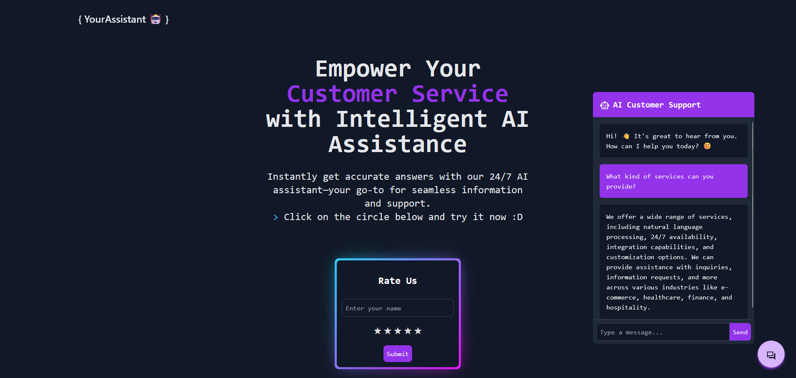

# AssistantAi

## Overview

AssistantAi is an AI-powered customer assistant chatbot built with Java and Spring Boot. Designed to provide intelligent and adaptive customer service, this chatbot leverages advanced natural language processing (NLP) to understand and respond to customer queries. The chatbot is built to handle a variety of tasks, ensuring a seamless interaction experience.

## Features

- **Natural Language Processing (NLP)**: Understands and responds to customer queries in natural language, simulating a human-like conversation.
- **Contextual Awareness**: Maintains context within conversations, ensuring that responses are relevant and appropriate to the user's query.

```
> User: What kind of services can you provide?
> Bot: We offer a wide range of services, including natural language processing, 24/7 availability, integration capabilities, and customization options. We can provide assistance with inquiries, information requests, and more across various industries like e-commerce, healthcare, finance, and hospitality.
```

- **Strict Information Provision**: The chatbot is designed to only provide information and will clearly communicate its limitations. For example, if a user requests to book a ticket or make a reservation, the chatbot will respond by explaining that it is unable to perform such actions and that its mission is solely to provide information about AssistantAi.

```
> User: Can you book a hotel reservation?
> Bot: I am unable to perform actions such as booking hotel reservations. My purpose is to provide information and answer your questions.
```

- **Integration Capabilities**: Can be integrated with various platforms such as websites, mobile apps, and CRM systems.
- **Customizable and Scalable**: Easily customized to meet specific business needs and scalable to handle growing customer interactions.

## Technologies Used

- **Backend**: Java, Spring Boot, Spring Data JPA
- **Database**: MySQL
- **NLP Model**: OpenAI GPT (via `OpenAiChatModel`), Groq API
- **Frontend**: Vanilla Typescript, Axios, Tailwind CSS
- **Build Tool**: Maven
- **API**: RESTful API for interaction with the chatbot

## Pictures


